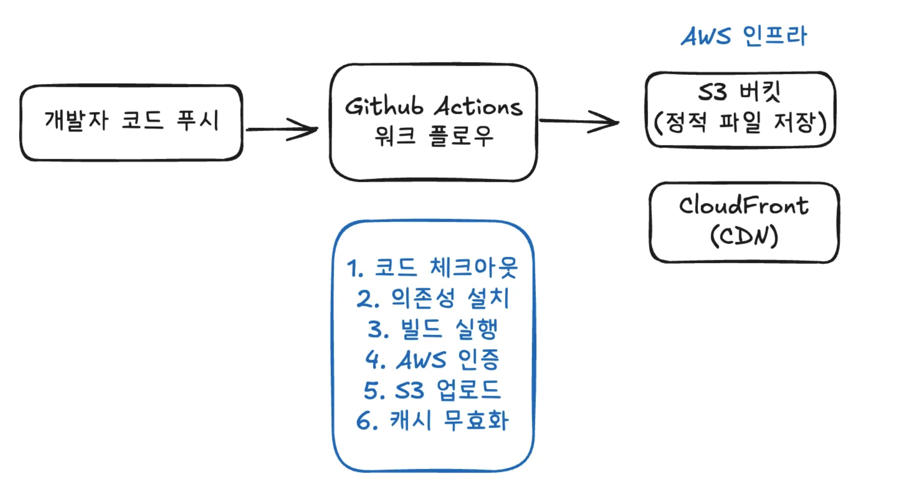

# 9주차 과제

GitHub와 AWS를 사용해 CDN이 적용된 프론트엔드 프로젝트 CI/CD 파이프라인을 구성

## 배포 프로세스

GitHub Actions 워크플로우를 통해 다음과 같은 자동화된 배포가 진행됩니다:

1. **코드 체크아웃**: `actions/checkout@v4`를 사용해 저장소 코드를 가져옵니다
2. **의존성 설치**: `npm ci` 명령어로 프로젝트 의존성을 설치합니다
3. **프로젝트 빌드**: `npm run build` 명령어로 Next.js 프로젝트를 정적 파일로 빌드합니다
4. **AWS 자격 증명 구성**: Repository Secret에 저장된 AWS 정보를 사용해 인증합니다
5. **S3 배포**: 빌드된 파일들을 S3 버킷에 동기화합니다 (`aws s3 sync --delete`)
6. **CloudFront 캐시 무효화**: 전 세계 CDN 캐시를 무효화하여 새 버전이 즉시 반영되도록 합니다

## 주요 링크

-   **S3 버킷 웹사이트 엔드포인트**: http://front-5th-chapter-4-1.s3-website-us-east-1.amazonaws.com/
-   **CloudFront 배포 도메인 이름**: https://d1dbxneramfnvz.cloudfront.net/

## 주요 개념

### GitHub Actions과 CI/CD 도구

GitHub에서 제공하는 CI/CD 플랫폼입니다. 코드 변경사항이 있을 때마다 자동으로 빌드, 테스트, 배포 과정을 수행하여 개발 워크플로우를 자동화하는 것입니다. YAML 파일로 워크플로우를 정의하고 다양한 이벤트(git push, pull request 등)에 반응하여 작업을 실행할 수 있습니다.

### S3와 스토리지

S3는 AWS에서 제공하는 객체 스토리지(자료에서는 웹하드로 설명해주셔서 이해하기 쉬웠습니다.)입니다. 정적 웹사이트 호스팅 기능을 제공하고, HTML, CSS, JS, 이미지, 폰트 등을 저장하고 웹에서 직접 서빙할 수 있습니다. 사용한 만큼 비용을 지불하는 종량제 방식입니다.

### CloudFront와 CDN

CDN은 전 세계에 분산된 엣지 로케이션을 통해 사용자에게 빠른 콘텐츠 전송을 제공합니다. S3에 저장한 파일들을 캐싱하여 가까운 서버에서 콘텐츠를 받을 수 있게 합니다.

**국내 제한적인 서비스도 사용하는지 궁금했습니다..!**

서울 서버 기준:

-   **서울 사용자**: 0~10ms
-   **부산 사용자**: 50~80ms
-   **제주 사용자**: 100ms+

### 캐시 무효화(Cache Invalidation)

캐시 무효화는 CDN에 저장된 기존 캐시를 강제로 삭제하여 새로운 콘텐츠로 교체하는 과정입니다. 웹사이트를 업데이트했을 때 이전 버전이 계속 표시되는 것을 방지하기 위해 필요합니다. 배포 파이프라인에서는 S3 업로드 완료 후 즉시 `aws cloudfront create-invalidation` 명령을 실행하여 모든 경로(`/*`)의 캐시를 무효화합니다.

### Repository Secret과 환경변수

GitHub에서 제공하는 보안 기능으로, AWS 액세스 키와 같은 민감한 정보를 안전하게 저장합니다. 코드에 직접 노출되지 않으면서도 GitHub Actions에서 `${{ secrets.VARIABLE_NAME }}` 형태로 사용할 수 있습니다. 이를 통해 보안을 유지하면서 자동화된 배포가 가능합니다. (API KEY 같은 것 = 민감 정보를 저장할 수 있음)

## CDN과 성능 최적화

### 📈 **CDN 도입 전후 성능 비교**

| S3                                       | CloudFront (CDN)                          |
| ---------------------------------------- | ----------------------------------------- |
|  |  |

#### 전체 로딩 성능 비교

| 지표                 | S3 직접 (정적파일) | CloudFront (CDN) | 개선율         |
| -------------------- | ------------------ | ---------------- | -------------- |
| **총 로딩 시간**     | 6.85초             | 6.28초           | **8.3% 개선**  |
| **전송 데이터**      | 490 kB             | 208 kB           | **57.6% 절약** |
| **총 리소스 크기**   | 484 kB             | 484 kB           | 동일           |
| **DOMContentLoaded** | 455 ms             | 41 ms            | **91% 개선**   |
| **Load 이벤트**      | 1.31초             | 96 ms            | **92.7% 개선** |

#### 주요 리소스별 로딩 시간 비교

| 파일 종류                | S3 직접    | CloudFront (CDN) | 개선율          |
| ------------------------ | ---------- | ---------------- | --------------- |
| **HTML 문서**            | 220 ms     | 7 ms             | **96.8% 개선**  |
| **폰트 파일들**          | 217-231 ms | 13-15 ms         | **93-94% 개선** |
| **CSS 스타일시트**       | 219 ms     | 15 ms            | **93.2% 개선**  |
| **대형 JS 번들 (169kB)** | 610 ms     | 15 ms            | **97.5% 개선**  |
| **대형 JS 번들 (175kB)** | 831 ms     | 24 ms            | **97.1% 개선**  |
| **중형 JS 파일들**       | 210-230 ms | 11-25 ms         | **85-90% 개선** |
| **SVG 아이콘들**         | 210-443 ms | 16-25 ms         | **92-94% 개선** |
| **Favicon**              | 221 ms     | 11 ms            | **95% 개선**    |

#### 성능 개선 하이라이트

| 개선 항목            | 수치                | 임팩트                                  |
| -------------------- | ------------------- | --------------------------------------- |
| **초기 렌더링 속도** | 455ms → 41ms        | **사용자가 콘텐츠를 보기까지 91% 단축** |
| **페이지 로딩 완료** | 1.31초 → 96ms       | **사용자 상호작용 가능시점 92.7% 단축** |
| **대역폭 사용량**    | 490kB → 208kB       | **57.6% 절약으로 비용 효율성 향상**     |
| **대형 파일 전송**   | 610-831ms → 15-24ms | **JavaScript 번들 97% 속도 향상**       |

### 💡 **실무 인사이트**

> CDN 도입으로 사용자 경험이 혁신적으로 개선되었습니다.  
> 특히 **초기 렌더링 속도 91% 개선**과 **대형 파일 전송 97% 개선**은 웹사이트의 품질을 완전히 다른 차원으로 끌어올렸습니다.

#### 🚀 **비즈니스 임팩트**

-   **이탈률 대폭 감소**: 3초 이상 로딩 시 53% 이탈하는데, 대부분 리소스가 25ms 이내 로딩
-   **SEO 점수 향상**: Core Web Vitals 모든 지표에서 극적인 개선으로 검색 순위 상승 기대
-   **모바일 사용성**: 느린 모바일 네트워크에서도 데스크톱 수준의 경험 제공
-   **운영비용 절감**: 대역폭 사용량 57.6% 절약으로 월간 트래픽 비용 대폭 감소

#### 🎯 **CDN 최적화 성공 요인**

1. **완벽한 캐시 적중**: 모든 정적 리소스가 CDN 엣지 서버에서 서빙
2. **지리적 최적화**: 사용자와 가장 가까운 서버에서 콘텐츠 전송
3. **네트워크 최적화**: AWS CloudFront의 프리미엄 네트워크 활용
4. **압축 효율성**: Gzip/Brotli 압축으로 전송량 최적화
